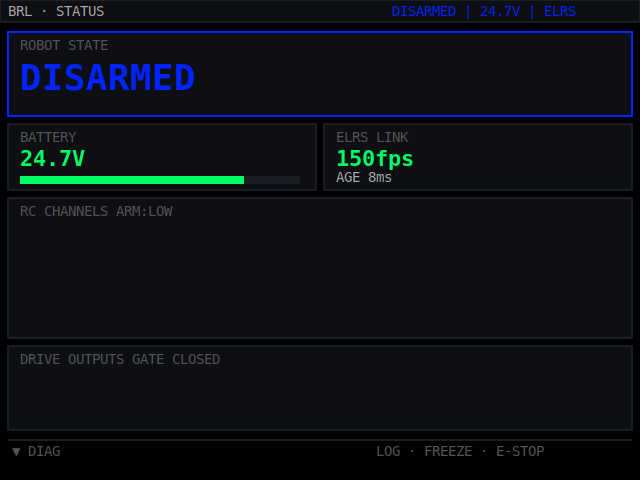

# BRL RDT-H1 ESP32-S3 UI (LVGL v8)

Embedded-only 320x240 firmware UI for ESP32-S3 + ILI9341-class SPI TFT.

## Build / Flash

### PlatformIO
1. Connect ESP32-S3.
2. Adjust TFT pin `build_flags` in `platformio.ini` as needed for your board.
3. Build and flash:
   ```bash
   pio run -t upload
   ```
4. Open serial monitor:
   ```bash
   pio device monitor
   ```

### Arduino IDE
- Use ESP32 Arduino core + install `lvgl` and `TFT_eSPI` libraries.
- Mirror pin and panel settings from `platformio.ini` into your `TFT_eSPI/User_Setup`.
- Compile and upload as ESP32-S3 target.

## Demo Script Behavior
The firmware has placeholder input actions and drives them automatically via `ui_demo_tick()`:
- BOOT screen fills progress and transitions to PRIMARY.
- Auto-cycles screens: PRIMARY → DIAG → LOGS → AUTOTEST → COMPTEST.
- Periodically toggles freeze bar, shows log modal, triggers E-STOP overlay, then resumes.
- Sim data ticker updates voltage, packet rate, signal age, robot state, and PWM fields.


## Preview
- Static layout preview (320×240 display-only mock): `docs/preview.html`.
- Committed preview image for environments where generated artifacts expire: `docs/preview.svg`.



- Open in browser to quickly verify spacing/colors without flashing firmware.

## Where to Integrate NexBus Data
- Replace simulated field updates in `src/main.cpp` loop with decoded NexBus/UART frame values.
- Keep the same `UiData` struct contract in `src/ui/ui.h`.
- Call `ui_set_data(decoded_data)` each update cycle; UI rendering remains unchanged.

## File Layout
- `src/main.cpp`: LVGL + display init, tick source, simulator ticker.
- `src/ui/ui.h` + `src/ui/ui.cpp`: screen router/state machine, screens, overlays, demo input hooks.
- `src/ui/theme.h`: palette + common style helpers.
- `src/ui/widgets.h`: reusable LVGL primitives.
